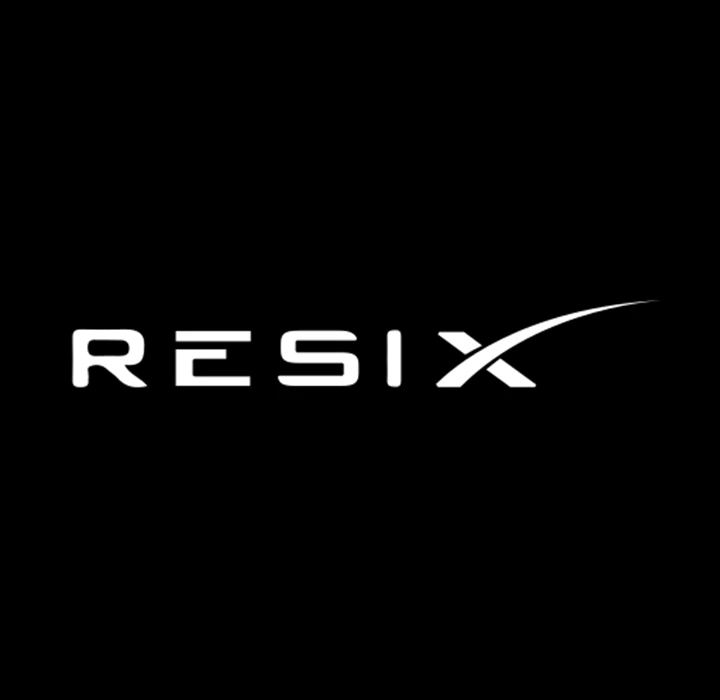
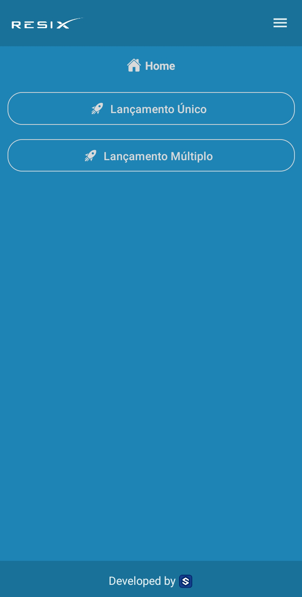
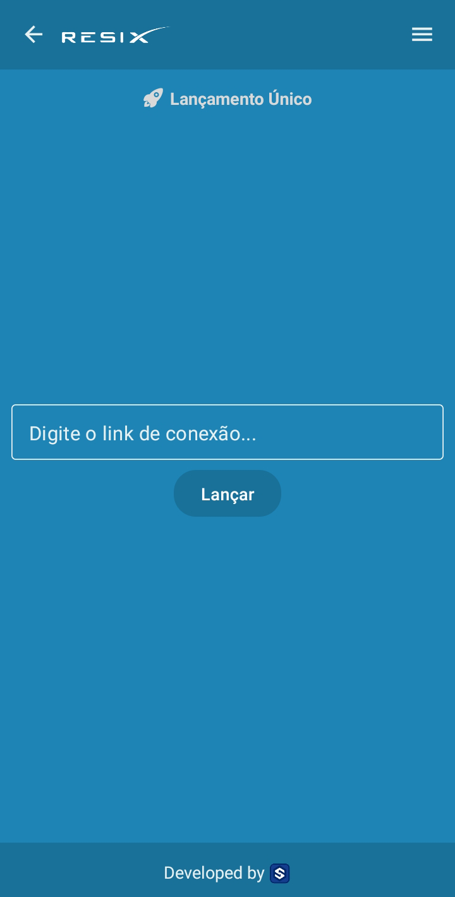
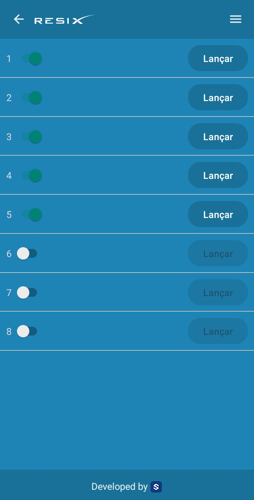

<h1 align="center">
  <br>
  <a href="#"></a>
  <br>
  Resix
  <br>
</h1>

<h4 align="center">Launch fireworks with <a href="https://pt.wikipedia.org/wiki/NodeMCU">ESP8266 IoT module</a> and WiFi connection. <br/><br/> Please, read the warning section before any type of usage of this project!</h4>

<p align="center">
  <a href="#">
    
  </a>
  <a href="#">
    
  </a>
  <a href="#">
    
  </a>
</p>

<p align="center">
  <a href="#about">About</a> •
  <a href="#getting-started">Getting Started</a> •
  <a href="#download">Download</a> •
  <a href="#warning">Warning</a> •
  <a href="#credits">Credits</a> 
</p>

<p align="center">



</p>

## About

Resix is a IoT project created to launch fireworks with NodeMCU module and WiFi connection to anywhere with just WiFi connection.

## Observation
<b>There's no functionality of real fireworks launch, the purpose of this project <i>at this moment</i> is only for UI matters.</b>

## Getting Started

### Prerequisites
You'll need to have a basic knowledge with:
- [React](https://reactjs.org) to manipulate the source-code
- [Expo](https://expo.dev/) open-source platform for making universal native apps for Android, iOS, and the web with JavaScript and React.

**Cloning the Repository**

```
$ git clone https://github.com/almeidiano/resix

$ cd resix
```

**Installing dependencies**

```
$ yarn
```

_or_

```
$ npm install
```

### Running

With all dependencies installed and the environment properly configured, you can now run the app. You need to run with <a href="https://expo.dev/">expo</a>

## Download

You can [download](https://github.com/almeidiano/resix/releases) the releases containing all versions of Resix.

## Warning

The use of this project is at your own risk. 
The developer and owner of this app make no representations or warranties of any kind about the bad usage contained in the app or the source code for any purpose. 
The user who is using the app OR/AND changing the source code for any purpose will be responsible, whatsoever arising out of bad use. 
Any reliance you place on such this usage is therefore strictly at your own risk.

## Credits

This software uses the following these technologies:

- [React-Native](https://facebook.github.io/react-native/) - Build the native app using JavaScript and React
- [React-Navigation](https://reactnavigation.org/docs/en/getting-started.html) - Router

## Author

👤 **Samuel de Almeida**

* Portfolio: [samuelalmeidadev.com.br](https://samuelalmeidadev.com.br/)
* Github: [@almeidiano](https://github.com/almeidiano)
* LinkedIn: [Samuel de Almeida](https://br.linkedin.com/in/samuel-de-almeida)

## 🤝 Contributing

Contributions, issues and feature requests are welcome!

## Show your support

Give a ⭐️ if this project helped you!

## License

MIT
